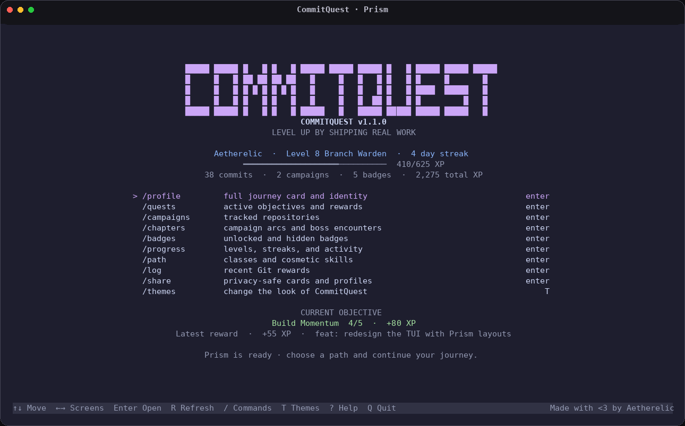
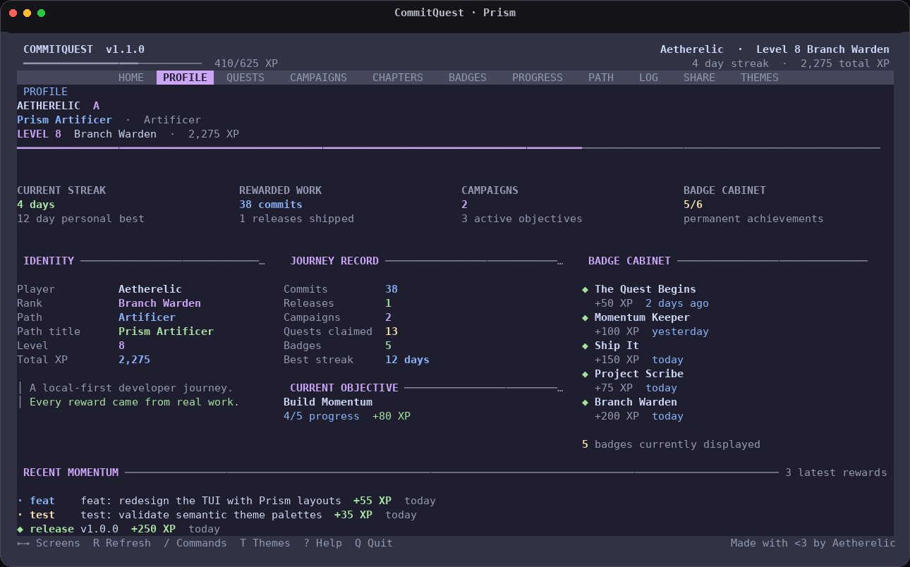
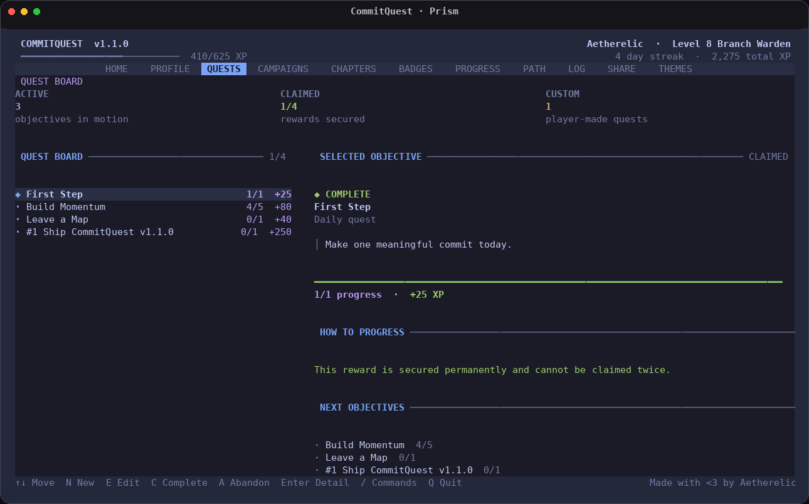
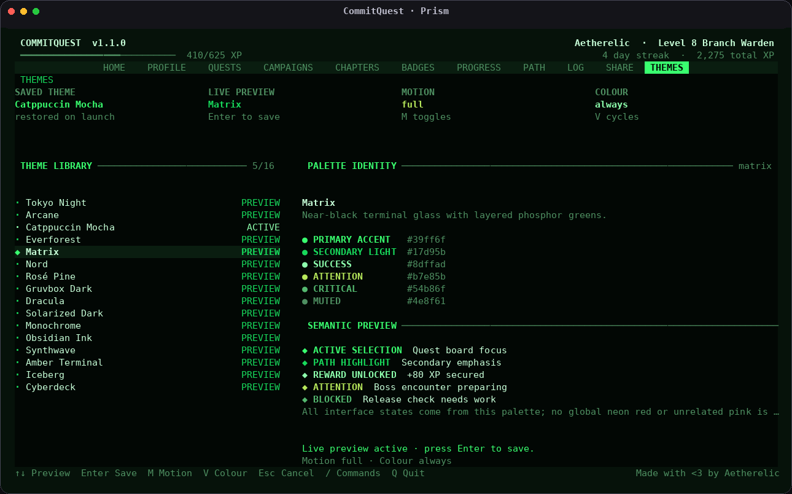

<div align="center">

# ⚔️ CommitQuest

### Turn real Git progress into a private developer adventure.

CommitQuest is a local-first terminal RPG that transforms commits, releases and project milestones into **XP, quests, streaks, badges, chapters and boss encounters**.

[](https://github.com/Aetherelic/commitquest/releases)
[](https://github.com/Aetherelic/commitquest/actions/workflows/ci.yml)
[](https://nodejs.org/)
[](https://www.typescriptlang.org/)
[](flake.nix)
[](LICENSE)

<br>



</div>

## ✦ What is CommitQuest?

CommitQuest watches the Git repositories you choose and rewards genuine development progress. It stays on your machine, filters activity by your Git identity and never uploads repository contents.

- **Progression:** XP, levels, streaks, achievements and developer classes
- **Campaigns:** track repositories, chapters, milestones and release boss battles
- **Quests:** built-in objectives plus custom project-specific goals
- **Prism TUI:** full-screen profile, quest, campaign, progress and theme views
- **16 themes:** every status colour belongs to the selected palette
- **Recovery:** backups, integrity checks, repair tools and safe cleanup
- **Sharing:** privacy-safe SVG, Markdown and JSON journey cards

## ✦ Preview

<table>
  <tr>
    <td width="50%"></td>
    <td width="50%"></td>
  </tr>
  <tr>
    <td align="center"><strong>Profile and progression</strong></td>
    <td align="center"><strong>Readable quest board</strong></td>
  </tr>
</table>

<details>
<summary><strong>Theme browser — Matrix preview</strong></summary>
<br>

</details>

## ✦ Install

### NixOS / Nix

Install directly from GitHub:

```bash
nix profile install github:Aetherelic/commitquest
```

Or launch without installing:

```bash
nix run github:Aetherelic/commitquest
```

### Local installation

Requires **Git** and **Node.js 22.5+**.

```bash
git clone https://github.com/Aetherelic/commitquest.git
cd commitquest
npm ci
./scripts/install-local.sh
```

Ensure `~/.local/bin` is in your `PATH`:

```bash
export PATH="$HOME/.local/bin:$PATH"
```

## ✦ Begin your journey

```bash
cq init
cq add ~/Projects/your-project
cq hook install ~/Projects/your-project
cq
```

The post-commit hook is optional. CommitQuest will not overwrite an existing hook.

## ✦ Essential commands

| Command | Purpose |
|---|---|
| `cq` | Open the full-screen Prism interface |
| `cq scan` | Import new eligible Git activity |
| `cq quests` | View current objectives |
| `cq chapters` | View campaign arcs and progression |
| `cq boss` | Prepare and complete release encounters |
| `cq class list` | Explore developer paths |
| `cq share --format svg` | Export a privacy-safe journey card |
| `cq backup` | Create or restore local backups |
| `cq doctor` | Check installation and database health |
| `cq settings` | Configure theme, colour and motion |

Run `cq --help` for the complete command reference.

## ✦ Themes

Prism includes **Tokyo Night, Arcane, Catppuccin Mocha, Everforest, Matrix, Nord, Rosé Pine, Gruvbox Dark, Dracula, Solarized Dark, Monochrome, Obsidian Ink, Synthwave, Amber Terminal, Iceberg and Cyberdeck**.

Selections, rewards, warnings and errors always use colours defined by the active theme—Matrix stays phosphor green, Catppuccin stays Mocha, and Monochrome remains grayscale.

## ✦ Local-first by design

CommitQuest stores progress in a local SQLite database. Default exports exclude repository paths, Git emails and commit subjects; project names are only included when explicitly requested.

```bash
cq privacy
cq doctor
cq backup
```

---

<div align="center">

Built with TypeScript, SQLite and an unreasonable appreciation for beautiful terminals.

[Documentation](docs) · [Changelog](CHANGELOG.md) · [Contributing](CONTRIBUTING.md) · [Security](SECURITY.md) · [MIT License](LICENSE)

**Made with &lt;3 by [Aetherelic](https://github.com/Aetherelic)**

</div>
